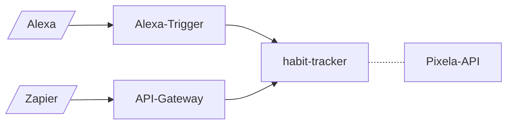

# habit-tracker

## Overview
[Pixela](https://pixe.la/) is an API that allows you to track a habit or effort, such as learning a new skill or training for a sport. This can then be visualised nicely via a graph:


habit-tracker allows you to interact with the Pixela API via a Lambda function. This could be called via an Alexa skill or a Zapier workflow for example.



## Input
The lambda function expects an action along with required arguments :

```json
    {
        "action": "create_graph",
        "graph": "test-graph",
        "description": "Graph for test case",
        "unit": "hours"
    }

```
